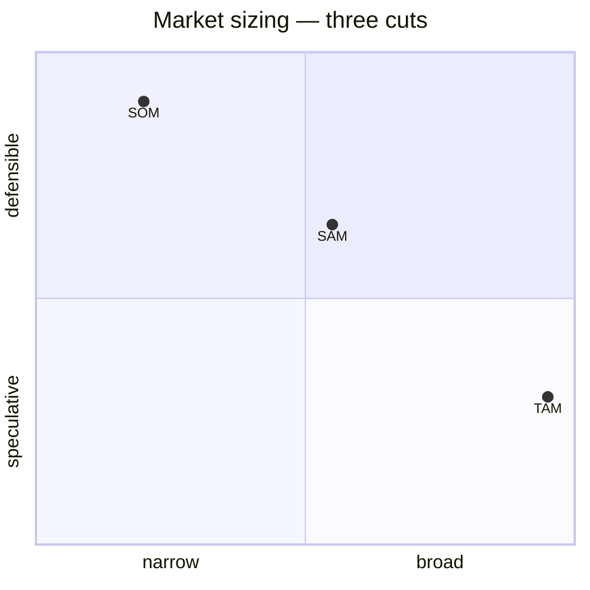

# Agent Integration — Market Research (TAM/SAM/SOM)

> **Variant:** `market-researcher` — investor-facing sizing, GTM-aligned segmentation, pricing-tier decomposition. The sister copy under `../../researcher/market-research-tam-sam-som/` covers methodology mechanics and triangulation hygiene; this file focuses on how a market-researcher subagent uses the numbers to drive a pitch deck, a GTM plan, and a pricing structure.

## When to use
- Seed/Series-A pitch deck slide 4 (Market) — needs three numbers, three sources, one chart, one defensible SOM growth curve.
- Investor follow-up Q&A: "Walk me through how you got to that SAM" — output must hold up to a partner-level grilling.
- GTM segmentation kickoff: SAM is split per channel (PLG vs. outbound vs. partner) so the marketer can allocate CAC budget by segment economics.
- Pricing-tier sizing: each tier (Starter / Pro / Enterprise) gets its own ARPU × addressable-count math; rolls up to per-tier SOM forecasts.
- Re-sizing after a pivot, geography expansion, or new pricing page — the deck and the model must agree.
- Board update: comparing SOM-actual vs. SOM-plan for the trailing quarter.

## When NOT to use
- Hobby projects, internal tooling, free OSS — investors are not the audience, sizing is theatre.
- Two-sided marketplaces pre-launch — supply liquidity dominates raw market size; size GMV later.
- Replacement for win/loss interviews — TAM/SAM/SOM does not explain why deals close.
- Already-shipping products where bottoms-up cohort revenue forecasts are stronger than top-down resizing.
- Deep-tech / regulatory plays where the addressable buyer count depends on a license decision, not a market study.
- Solo "freemium with no paid plan" projects — SAM × ARPU collapses to zero, sizing adds no signal.

## Where it fails / limitations
- "Investor TAM": the slide says $50B, the plan says $5M; partners spot the gap inside 90 seconds.
- Pricing-tier SOM that ignores the realistic mix — quoting Enterprise ARPU × Enterprise count without a Starter-heavy funnel reality check.
- GTM-aligned SAM that double-counts a customer reachable through both PLG and outbound — segments must be exclusive, not overlapping.
- Single-currency reports for multi-region GTM — EU SAM in EUR mixed with US SAM in USD silently inflates SOM.
- Static SOM in a fast-moving category — every 6 months the curve must be redrawn, or the deck rots.
- "Bottom-up = customer count × headline list price" — ignores discounting, annual vs. monthly, churn; produces fantasy ARR.
- LLM anchor bias: an agent told "we want to look investable" produces a 1% SOM that nobody can defend.

## Agentic workflow
The market-researcher subagent operates in three cuts: **investor cut** (one slide, one chart, three numbers), **GTM cut** (SAM split per acquisition channel with CAC envelope), **pricing cut** (TAM/SAM/SOM decomposed per pricing tier with ARPU and mix assumptions). All three derive from the same triangulated base (delegate the base computation to the `researcher` variant), but each renders for a different audience. The agent never invents the base numbers — it consumes the canonical `.aidocs/product_docs/market-research.md` and projects onto the three views.

Concrete pipeline:
1. Load base — read `.aidocs/product_docs/market-research.md`; abort if missing or `confidence=Low` on TAM.
2. Investor cut — pick one chart type (3-circle nested, or 3-bar with growth arrow); cap text at 40 words.
3. GTM cut — split SAM into mutually-exclusive channel buckets (PLG, outbound, partner, content) and attach a CAC ceiling per bucket from `pricing-research.md`.
4. Pricing cut — for each tier in `pricing-research.md`, compute tier-SAM = SAM × tier-mix, tier-SOM = tier-SAM × realistic-share; tag each line with the LTV/CAC sanity check.
5. Stress test — agent runs three "what breaks this" scenarios (pricing change, segment shrink, competitor entry) and re-renders SOM.
6. Investor-objection rehearsal — agent drafts 5 likely partner questions and the one-line answer for each.
7. Hand-off — investor cut → `slides/market.md`; GTM cut → `gtm-plan.md`; pricing cut → `pricing-research.md` appendix.

### Recommended subagents
- `faion-market-researcher-agent` — owns this file; produces the three cuts from the canonical base.
- `faion-research-agent` (parent orchestrator) — runs `mode=market` first to build the canonical base; then dispatches this subagent for the cuts.
- `faion-pricing-research-agent` (sibling) — supplies tier list, ARPU per tier, expected mix.
- `faion-competitor-analysis-agent` (sibling) — supplies competitor revenue sums for SAM cross-check.
- `faion-gtm-strategist-agent` (in `pro/marketing/gtm-strategist/`) — consumes the GTM cut to allocate channel budget.
- `faion-product-manager-agent` — consumes the pricing cut to set MRR/ARR targets in `roadmap.md`.

### Prompt pattern
```
You are the market-researcher subagent. The canonical sizing exists at
.aidocs/product_docs/market-research.md. Produce THREE cuts:
(1) Investor cut — 1 slide, 3 numbers, 1 chart, 40 words max, partner-defensible.
(2) GTM cut — SAM split into PLG / outbound / partner / content; mutually exclusive;
    attach CAC ceiling per bucket from pricing-research.md.
(3) Pricing cut — per tier (Starter/Pro/Enterprise): tier-SAM, tier-ARPU, tier-mix,
    tier-SOM (3-yr); LTV/CAC > 3 check per tier.
Do NOT recompute the base TAM/SAM/SOM. Refuse if base confidence < Medium.
```
```
Investor objection rehearsal: read slides/market.md and produce 5 partner-level
questions + a one-line evidence-based answer for each. Cite the row in
market-research.md that supports the answer.
```

## CLI tools
| Tool | Purpose | Install / docs |
|------|---------|----------------|
| `marp-cli` | Render the investor cut to PDF/PNG slide | `npm i -g @marp-team/marp-cli` |
| `mermaid-cli` (`mmdc`) | Generate the nested-circle TAM/SAM/SOM SVG | `npm i -g @mermaid-js/mermaid-cli` |
| `vega-lite` / `vl-convert` | Scriptable charts (per-tier SOM growth) | vega.github.io/vega-lite |
| `gh` | Push the deck to a private repo for VC sharing | cli.github.com |
| `pandoc` | One-shot md → pptx/keynote conversion | pandoc.org |
| `csvkit` | Tier-mix tables, sanity-check sums | csvkit.rtfd.io |
| `crunchbase-api` | Competitor ARR for SAM cross-check | data.crunchbase.com/docs |
| `similarweb-api` | Channel-traffic split for the GTM cut | developers.similarweb.com |
| `apollo-api` / `clearbit-api` | Tier-ICP company counts (firmographics) | apollo.io/api |
| `google-trends` (`pytrends`) | Demand signal per pricing tier (Starter vs. Enterprise queries) | pypi.org/project/pytrends |
| `claude` (Anthropic CLI) | Drive the three-cut prompt in batch | docs.anthropic.com |

## Services & apps
| Service | Type | Agent-friendly? | Notes |
|---------|------|-----------------|-------|
| Pitch.com / Beautiful.ai | Deck SaaS | Partial — no scripting API | Final visual polish only |
| Notion + Notion API | Sizing dashboard, investor data room | Yes — REST API | Source-of-truth for the three cuts |
| Crunchbase | Competitor revenue / funding | Yes — REST | Anchors the SAM cross-check |
| PitchBook | Late-stage private comps | Partial — enterprise API | Required for Series-B+ decks |
| Tegus / AlphaSense | Expert-call transcripts | Partial — enterprise | Validates ARPU and mix assumptions |
| Capterra / G2 | Per-tier review counts | Partial — scrape | Proxy for tier-mix in market |
| Stripe Atlas / ChartMogul | Public SaaS benchmarks | Yes — public datasets | Anchor LTV/CAC ratios per tier |
| OpenView SaaS Benchmarks | Annual ARPU/mix data | Yes — public PDF | Free, frequently updated |
| Bessemer Cloud Index | Public-comp ARR multiples | Yes — public dashboard | Reasonable check on SOM × multiple = exit value |
| Notion / Coda | Investor data room | Yes — APIs | Hosts the three cuts side-by-side |
| Mixpanel / Amplitude | Funnel data for bottom-up SOM | Yes — REST | Trial → paid conversion per tier |
| HubSpot / Pipedrive | Outbound-channel CAC reality | Yes — REST | Feeds the GTM cut bucket math |

## Templates & scripts
See `templates.md` for the base Market Sizing Report. Inline pricing-tier decomposition helper:

```bash
#!/usr/bin/env bash
# tier-som.sh — decompose SAM/SOM per pricing tier with LTV/CAC sanity check
# usage: ./tier-som.sh sam_usd tiers.csv share_y3
# tiers.csv columns: name,mix_pct,arpu_usd,gross_margin,cac_usd,churn_monthly
set -euo pipefail
sam=$1; csv=$2; share=$3
printf '%-12s %12s %10s %10s %10s %10s %10s\n' \
  tier tier_sam arpu mix_pct tier_som ltv ltv_cac
tail -n +2 "$csv" | while IFS=, read -r name mix arpu gm cac churn; do
  ts=$(awk -v s="$sam" -v m="$mix" 'BEGIN{printf "%.0f", s*m/100}')
  tsom=$(awk -v ts="$ts" -v sh="$share" 'BEGIN{printf "%.0f", ts*sh}')
  ltv=$(awk -v a="$arpu" -v g="$gm" -v c="$churn" \
    'BEGIN{ if(c<=0){print 0; exit} printf "%.0f", (a*g/100)/(c/100) }')
  lc=$(awk -v l="$ltv" -v c="$cac" \
    'BEGIN{ if(c<=0){print "inf"; exit} printf "%.2f", l/c }')
  printf '%-12s %12s %10s %10s %10s %10s %10s\n' \
    "$name" "$ts" "$arpu" "$mix" "$tsom" "$ltv" "$lc"
done
```

Investor cut Mermaid template (drop into `slides/market.md`):


## Best practices
- One canonical base, three cuts — never let the investor cut and the GTM cut disagree on the SAM number.
- Investor cut fits on one slide; if it does not, the agent has not finished the work.
- For each pricing tier, publish the LTV/CAC ratio next to the tier-SOM; ratios under 3 trigger a red flag.
- GTM channel buckets must be mutually exclusive; double-counting a customer between PLG and outbound is the #1 audit failure.
- Cite source + retrieval date next to every cell that an investor might challenge; the rest can stay light.
- Express tier-SOM in customer count first ("12,000 Pro seats"), dollars second; investors trust the count more than the dollar.
- Round aggressively for the slide ($8B), preserve precision in the appendix ($8.27B); never the reverse.
- Stress-test the SOM curve with at least one adverse scenario (CAC doubles, ARPU drops 30%) and keep the alt-curve ready for Q&A.
- Lock the deck cut in `slides/market.md` to a content hash; if the canonical base changes, the agent must re-render, not hand-edit.
- Re-validate quarterly against actuals: SOM-plan vs. SOM-actual; the delta drives next-quarter assumptions.
- For a multi-region GTM cut, normalize all currencies to USD with a dated FX rate captured in the appendix.
- Map every pricing tier to a real ICP firmographic — "Pro tier = 10–50 employees in NA SaaS"; abstract tiers do not size.

## Investor-cut hygiene
- Slide 4 rule: TAM/SAM/SOM appear in that order, three numbers, three sources, three growth arrows; the rest of the slide is text.
- Honest TAM ceiling: agents should disclose "TAM = if-100% scenario" in a footnote; partners reward honesty.
- Avoid "expanding TAM" without a roadmap — if the deck claims TAM grows from $5B to $50B, the appendix must show the wedge.
- The growth arrow on SOM must match the financial model exit-year ARR; if the model says $20M Y5 and the slide says $40M, the deck loses.
- Comparable comps row: TAM/SAM/SOM next to two public comps' equivalents at the same stage — instant credibility.

## GTM-aligned segmentation
- Channel buckets follow CAC reality: PLG (low CAC, low ACV), outbound (high CAC, high ACV), partner (medium CAC, medium ACV), content/SEO (decaying low CAC).
- Each channel bucket has a SAM ceiling — total reachable accounts via that channel; do not let the GTM plan exceed it.
- The CAC envelope per bucket comes from `pricing-research.md`; any tier with bucket-CAC > 0.33 × tier-LTV is GTM-blocked.
- Geography splits inside the GTM cut must align with the pricing cut — no GTM motion in a region where pricing is not localized.

## Pricing-tier sizing
- Tier-mix realism: most SaaS land 60–70% Starter, 25–30% Pro, 5–10% Enterprise; a deck claiming 40% Enterprise needs evidence.
- Tier-SOM = tier-SAM × realistic-share, where realistic-share is per-tier (Enterprise SOM share is typically lower than Starter).
- Floor: any tier whose Y3 SOM < 6 months of one engineer's salary should be cut from the deck — distraction.
- Tier-LTV uses tier-specific churn, not a blended rate; Starter churn is often 3–5x Enterprise churn.
- Expansion revenue belongs in the pricing-cut appendix, not in TAM — TAM is buyer × ARPU, expansion is post-conversion.

## AI-agent gotchas
- Agents conflate TAM (gross addressable) with ARR projection (net revenue) — print both with explicit labels every time.
- Tier-mix bias: LLMs default to even splits (33/33/33) which never matches reality; force the agent to read benchmarks.
- Channel double-count: agents happily put the same Shopify store in PLG and outbound counts; require a uniqueness key per row.
- "Investor cut" prompts that say "make it look big" reverse-engineer SOM; ban hint-prompts and lock the base inputs.
- Hallucinated comparables: an agent will invent a "Stripe is at 12% of TAM" line without a source — require URL or strike the row.
- Tier ARPU drift: agent uses list price; reality is list × (1 − discount) × annual-mix; require an effective-ARPU column.
- Currency soup: GTM EU bucket in EUR, US bucket in USD, summed to "SAM=$X" without conversion. Force a single normalized column.
- Static churn assumption: agent uses one churn rate across all tiers; the pricing cut breaks if Starter churn isn't tracked separately.
- Slide-text bloat: agent generates 200 words for slide 4; cap at 40 and let the appendix carry the math.
- Re-render drift: agent edits the slide directly instead of re-rendering from the canonical base; commit-hash the base so drift is detectable.
- Tier-floor blindness: agent leaves a tier with Y3 SOM under $200K in the deck; reviewer must auto-strip these.
- Cross-skill reach: this file is in `pro/`; if the calling agent is `solo` or `free`, abort — do not approximate the investor cut.

## Integration with faion-net SDD
- Canonical base lives at `.aidocs/product_docs/market-research.md` — owned by the `researcher` orchestrator.
- This file's three cuts land at:
  - `slides/market.md` — investor cut (committed pre-deck-send).
  - `.aidocs/product_docs/gtm-plan.md` — GTM cut (consumed by `growth-marketer` and `gtm-strategist` skills).
  - `.aidocs/product_docs/pricing-research.md` — pricing cut appendix (consumed by `product-manager` for `roadmap.md`).
- Agent must verify the canonical base hash before rendering; mismatch → abort and re-trigger `mode=market`.
- Quarterly re-render: a scheduled job runs the agent against the latest base + actuals and diffs the cuts; a delta > 20% on SOM opens an SDD task.
- Two parallel copies of this methodology exist (`researcher/` and `market-researcher/`); the `market-researcher` copy owns the three cuts, the `researcher` copy owns triangulation. Never let them disagree on the base.

## References
- Sister methodology file (triangulation mechanics): `../../researcher/market-research-tam-sam-som/agent-integration.md`.
- This directory: `README.md`, `checklist.md`, `templates.md`, `examples.md`, `llm-prompts.md`.
- Related methodologies in this skill: `competitor-analysis`, `competitive-intelligence`, `business-model-research`, `business-model-planning`, `distribution-channel-research`, `risk-assessment`.
- Cross-skill: `pro/marketing/gtm-strategist/`, `pro/product/product-manager/`, `pro/marketing/growth-marketer/`.
- Steve Blank, "Market Size: TAM, SAM, SOM" — steveblank.com
- a16z, "16 Startup Metrics" — a16z.com/2015/08/21/16-metrics
- Bessemer "State of the Cloud" — bvp.com/atlas/state-of-the-cloud
- OpenView "SaaS Benchmarks" — openviewpartners.com/saas-benchmarks
- ChartMogul "SaaS Metrics Benchmarks" — chartmogul.com/reports
- ProfitWell / Paddle "Pricing Benchmarks" — paddle.com/resources
