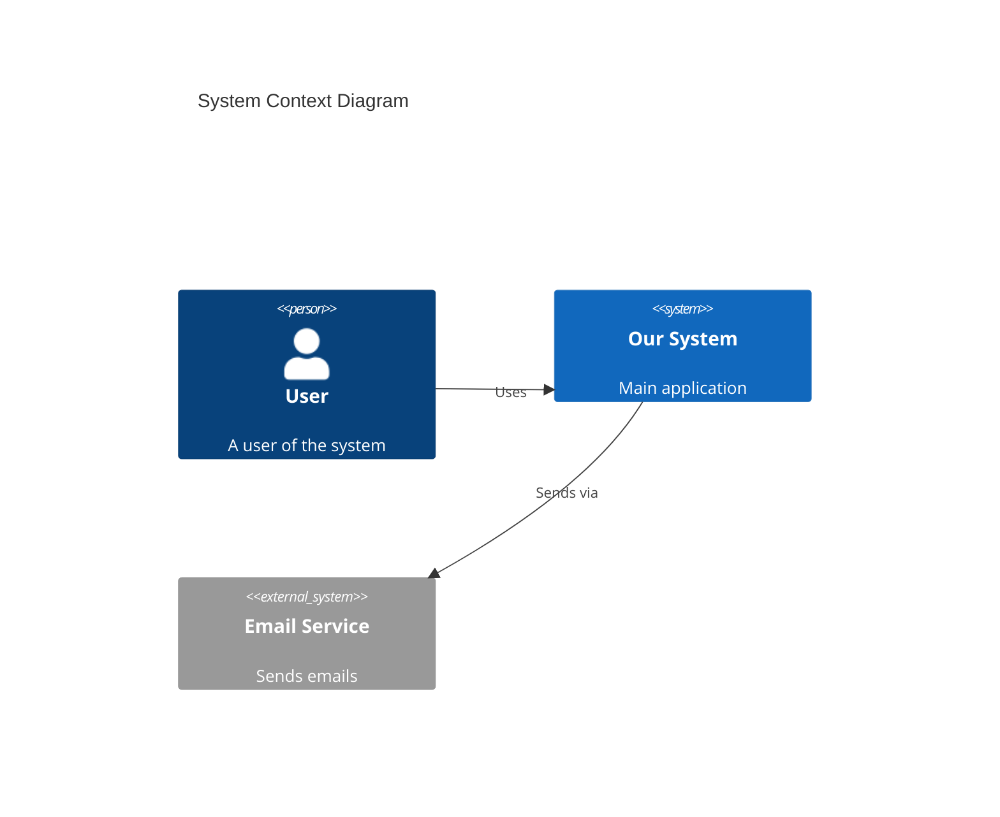

# C4 Model

Hierarchical approach to diagramming software architecture.

## Four Levels

```
Level 1: CONTEXT
         └─ System + external actors (users, systems)

Level 2: CONTAINER
         └─ High-level tech choices (web app, API, DB)

Level 3: COMPONENT
         └─ Components within a container

Level 4: CODE
         └─ Class/module level (usually auto-generated)
```

## Level 1: System Context Diagram

**Purpose:** Show system in its environment

**Elements:**
- Your system (one box)
- Users (people)
- External systems

**Template:**
```
┌─────────────┐
│   User A    │
└──────┬──────┘
       │
       ▼
┌─────────────────────┐
│   YOUR SYSTEM       │
│   [Software System] │
└──────┬──────────────┘
       │
       ▼
┌─────────────────────┐
│   External System   │
│   [Software System] │
└─────────────────────┘
```

## Level 2: Container Diagram

**Purpose:** Show high-level tech decisions

**Containers:** Deployable units
- Web application
- API service
- Database
- Message queue
- File storage

**Template:**
```
┌────────────────────────────────────────────┐
│                YOUR SYSTEM                  │
│  ┌──────────┐  ┌──────────┐  ┌──────────┐  │
│  │  Web App │  │   API    │  │   DB     │  │
│  │ [React]  │─▶│ [Python] │─▶│ [Postgres]│  │
│  └──────────┘  └──────────┘  └──────────┘  │
└────────────────────────────────────────────┘
```

## Level 3: Component Diagram

**Purpose:** Show components within a container

**Components:** Major building blocks
- Controllers
- Services
- Repositories
- Handlers

**Template:**
```
┌────────────────────────────────────────────┐
│              API CONTAINER                  │
│  ┌──────────┐  ┌──────────┐  ┌──────────┐  │
│  │Controller│─▶│ Service  │─▶│Repository│  │
│  └──────────┘  └──────────┘  └──────────┘  │
│                     │                       │
│                     ▼                       │
│               ┌──────────┐                  │
│               │ External │                  │
│               │  Client  │                  │
│               └──────────┘                  │
└────────────────────────────────────────────┘
```

## Level 4: Code Diagram

**Purpose:** UML class diagrams (optional, often auto-generated)

Usually not manually created. Use IDE tools.

## Notation

### Shapes

| Shape | Meaning |
|-------|---------|
| Person | User/actor |
| Software System | System boundary |
| Container | Deployable unit |
| Component | Building block |

### Relationships

```
──────▶  Uses / Calls
──────▷  Reads from / Writes to
- - - ▶  Async / Event
```

### Labels

```
[Container: Technology]
Example: [Container: Python/FastAPI]

[Component: Type]
Example: [Component: REST Controller]
```

## Best Practices

1. **Start with Context** - Always begin at Level 1
2. **One diagram per level** - Don't mix levels
3. **Label technologies** - Include tech stack
4. **Show data flow** - Direction of arrows matters
5. **Keep it simple** - 5-10 elements per diagram max
6. **Update regularly** - Architecture changes

## Tools

| Tool | Type |
|------|------|
| Structurizr | C4 native, DSL |
| PlantUML | Text-based |
| Mermaid | Markdown-friendly |
| draw.io | Visual editor |
| Excalidraw | Sketch-style |

## Mermaid Example



## Related

- [system-design-process.md](system-design-process.md) - Design workflow
- [architecture-decision-records.md](architecture-decision-records.md) - Document decisions
