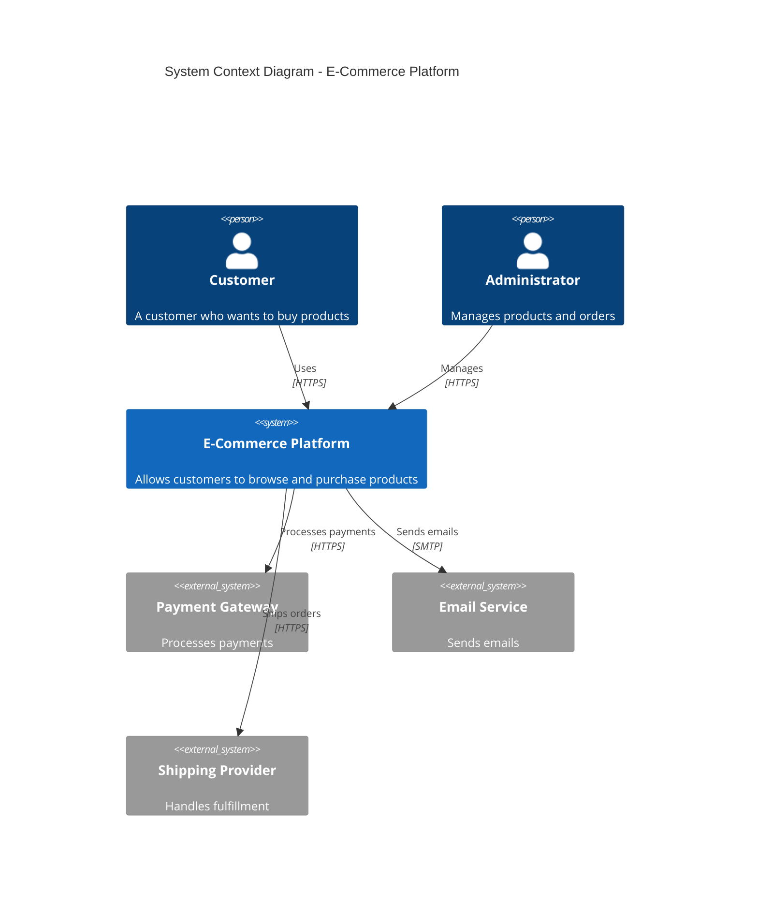
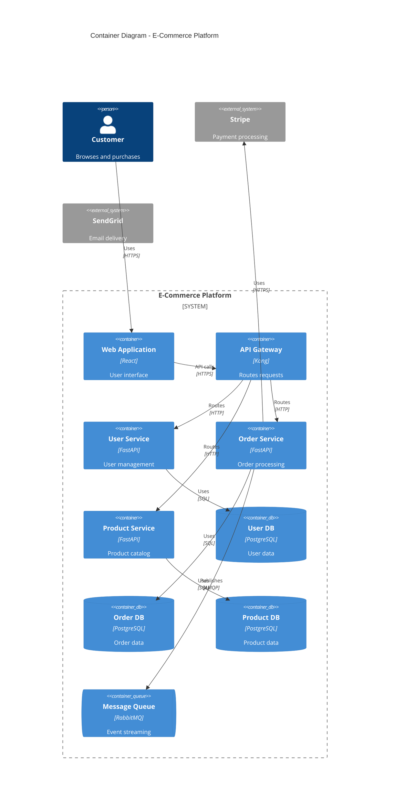
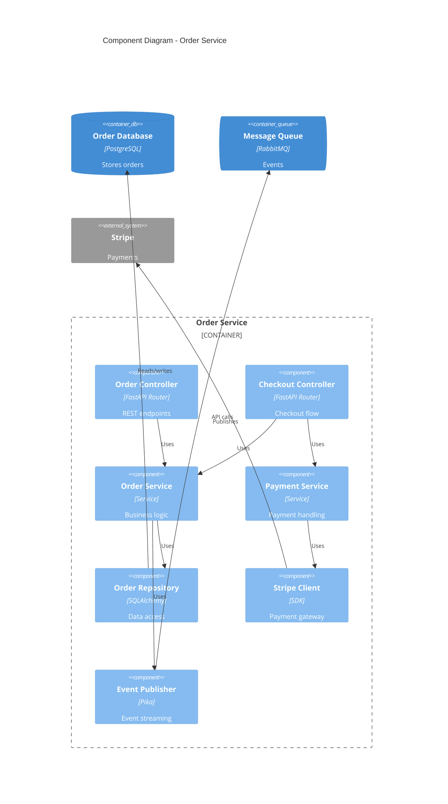
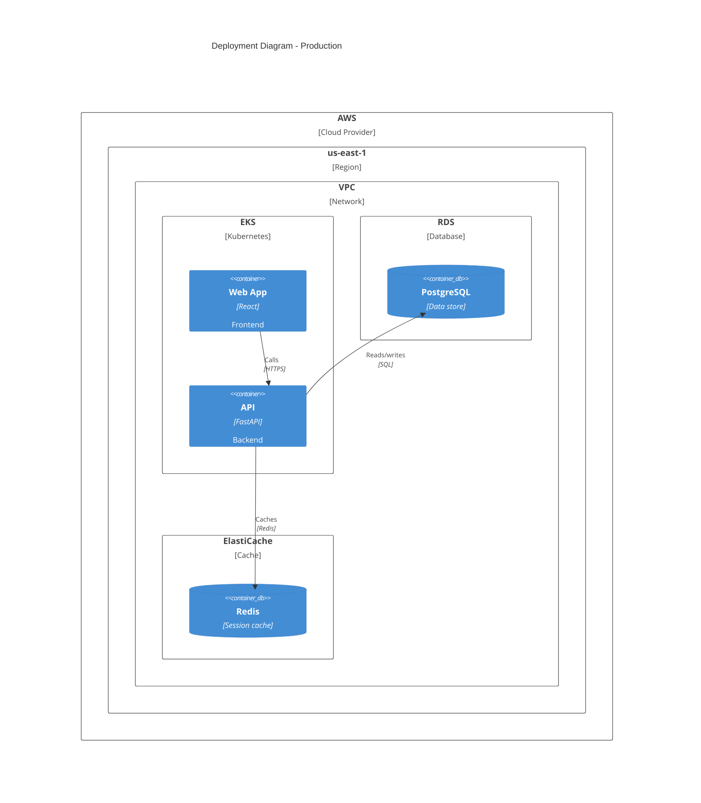

# C4 Model Templates

Copy-paste templates for C4 diagrams in various formats: Structurizr DSL, PlantUML, Mermaid, and draw.io.

---

## Structurizr DSL Templates

Structurizr DSL is the recommended format by Simon Brown. It's model-based, meaning you define elements once and create multiple views.

### Basic Workspace Structure

```dsl
workspace "Workspace Name" "Description of the workspace" {

    !identifiers hierarchical

    model {
        # Define people (users)
        user = person "User Name" "Description of user role"
        admin = person "Admin" "System administrator"

        # Define software systems
        system = softwareSystem "System Name" "System description" {
            # Define containers within the system
            webapp = container "Web Application" "Description" "React, TypeScript"
            api = container "API" "Description" "Python, FastAPI"
            database = container "Database" "Stores data" "PostgreSQL"
        }

        # Define external systems
        emailSystem = softwareSystem "Email System" "External email service" "External"
        paymentGateway = softwareSystem "Payment Gateway" "Processes payments" "External"

        # Define relationships
        user -> system "Uses"
        user -> system.webapp "Browses" "HTTPS"
        system.webapp -> system.api "Makes API calls" "JSON/HTTPS"
        system.api -> system.database "Reads/writes" "SQL"
        system.api -> emailSystem "Sends emails" "SMTP"
        system.api -> paymentGateway "Processes payments" "HTTPS"
    }

    views {
        # System Context Diagram
        systemContext system "SystemContext" {
            include *
            autoLayout
        }

        # Container Diagram
        container system "Containers" {
            include *
            autoLayout
        }

        # Styling
        styles {
            element "Software System" {
                background #1168bd
                color #ffffff
            }
            element "Person" {
                shape person
                background #08427b
                color #ffffff
            }
            element "Container" {
                background #438dd5
                color #ffffff
            }
            element "External" {
                background #999999
                color #ffffff
            }
        }
    }
}
```

### System Context Template

```dsl
workspace "System Context Example" {

    model {
        # Users
        customer = person "Customer" "A customer of the business"
        admin = person "Administrator" "Internal staff"

        # Main system
        mainSystem = softwareSystem "Our System" "Core business system"

        # External systems
        emailService = softwareSystem "Email Service" "SendGrid" "External"
        paymentProvider = softwareSystem "Payment Provider" "Stripe" "External"
        analyticsSystem = softwareSystem "Analytics" "Mixpanel" "External"

        # Relationships
        customer -> mainSystem "Uses for business operations"
        admin -> mainSystem "Configures and monitors"
        mainSystem -> emailService "Sends notifications via"
        mainSystem -> paymentProvider "Processes payments through"
        mainSystem -> analyticsSystem "Sends events to"
    }

    views {
        systemContext mainSystem "Context" {
            include *
            autoLayout lr
        }

        styles {
            element "Software System" {
                background #1168bd
                color #ffffff
            }
            element "Person" {
                shape person
                background #08427b
                color #ffffff
            }
            element "External" {
                background #999999
            }
        }
    }
}
```

### Container Diagram Template

```dsl
workspace "Container Diagram Example" {

    model {
        user = person "User" "End user of the application"

        system = softwareSystem "E-Commerce Platform" {
            webApp = container "Web Application" "Customer-facing UI" "React, TypeScript" "Browser"
            mobileApp = container "Mobile App" "iOS and Android app" "React Native" "Mobile"
            apiGateway = container "API Gateway" "Routes and authenticates requests" "Kong"

            userService = container "User Service" "Handles authentication and profiles" "Python, FastAPI"
            productService = container "Product Service" "Product catalog management" "Python, FastAPI"
            orderService = container "Order Service" "Order processing workflow" "Python, FastAPI"

            userDb = container "User Database" "Stores user data" "PostgreSQL" "Database"
            productDb = container "Product Database" "Stores product catalog" "PostgreSQL" "Database"
            orderDb = container "Order Database" "Stores orders" "PostgreSQL" "Database"

            cache = container "Cache" "Session and data cache" "Redis" "Database"
            queue = container "Message Queue" "Async task processing" "RabbitMQ" "Queue"
        }

        emailService = softwareSystem "Email Service" "SendGrid" "External"

        # Relationships
        user -> webApp "Uses" "HTTPS"
        user -> mobileApp "Uses"

        webApp -> apiGateway "API calls" "HTTPS"
        mobileApp -> apiGateway "API calls" "HTTPS"

        apiGateway -> userService "Routes to" "HTTP"
        apiGateway -> productService "Routes to" "HTTP"
        apiGateway -> orderService "Routes to" "HTTP"

        userService -> userDb "Reads/writes" "SQL"
        productService -> productDb "Reads/writes" "SQL"
        orderService -> orderDb "Reads/writes" "SQL"

        userService -> cache "Caches sessions" "Redis protocol"
        orderService -> queue "Publishes events" "AMQP"
        orderService -> emailService "Triggers emails" "HTTPS"
    }

    views {
        container system "Containers" {
            include *
            autoLayout
        }

        styles {
            element "Container" {
                background #438dd5
                color #ffffff
            }
            element "Database" {
                shape cylinder
                background #438dd5
            }
            element "Queue" {
                shape pipe
                background #438dd5
            }
            element "Browser" {
                shape webbrowser
            }
            element "Mobile" {
                shape mobiledeviceportrait
            }
            element "External" {
                background #999999
            }
        }
    }
}
```

### Component Diagram Template

```dsl
workspace "Component Diagram Example" {

    model {
        system = softwareSystem "System" {
            api = container "API Service" "Backend API" "Python, FastAPI" {
                # Controllers
                userController = component "User Controller" "REST endpoints for user operations" "FastAPI Router"
                orderController = component "Order Controller" "REST endpoints for orders" "FastAPI Router"
                webhookController = component "Webhook Controller" "Handles external webhooks" "FastAPI Router"

                # Services
                authService = component "Auth Service" "Authentication and authorization" "Service"
                userService = component "User Service" "User business logic" "Service"
                orderService = component "Order Service" "Order business logic" "Service"
                notificationService = component "Notification Service" "Email and push notifications" "Service"

                # Repositories
                userRepository = component "User Repository" "User data access" "SQLAlchemy"
                orderRepository = component "Order Repository" "Order data access" "SQLAlchemy"

                # External clients
                stripeClient = component "Stripe Client" "Payment processing" "Stripe SDK"
                sendgridClient = component "SendGrid Client" "Email sending" "SendGrid SDK"
            }

            database = container "Database" "PostgreSQL" "Database"
        }

        stripe = softwareSystem "Stripe" "Payment gateway" "External"
        sendgrid = softwareSystem "SendGrid" "Email service" "External"

        # Internal relationships
        api.userController -> api.authService "Uses"
        api.userController -> api.userService "Uses"
        api.orderController -> api.authService "Uses"
        api.orderController -> api.orderService "Uses"
        api.webhookController -> api.orderService "Uses"

        api.userService -> api.userRepository "Uses"
        api.orderService -> api.orderRepository "Uses"
        api.orderService -> api.notificationService "Uses"
        api.orderService -> api.stripeClient "Uses"

        api.notificationService -> api.sendgridClient "Uses"

        # External relationships
        api.userRepository -> database "Reads/writes"
        api.orderRepository -> database "Reads/writes"
        api.stripeClient -> stripe "API calls" "HTTPS"
        api.sendgridClient -> sendgrid "API calls" "HTTPS"
    }

    views {
        component api "Components" {
            include *
            autoLayout
        }

        styles {
            element "Component" {
                background #85bbf0
                color #000000
            }
        }
    }
}
```

### Deployment Diagram Template

```dsl
workspace "Deployment Diagram Example" {

    model {
        system = softwareSystem "System" {
            webApp = container "Web Application" "React SPA" "React"
            api = container "API" "Backend service" "Python, FastAPI"
            database = container "Database" "PostgreSQL"
            cache = container "Cache" "Redis"
        }

        # Deployment environments
        production = deploymentEnvironment "Production" {
            deploymentNode "AWS" {
                deploymentNode "us-east-1" {

                    deploymentNode "CloudFront" "" "AWS CloudFront" {
                        cdn = infrastructureNode "CDN" "Content delivery" "CloudFront"
                    }

                    deploymentNode "VPC" "" "AWS VPC" {

                        deploymentNode "Public Subnet" {
                            deploymentNode "ALB" "" "Application Load Balancer" {
                                lb = infrastructureNode "Load Balancer" "Routes traffic" "ALB"
                            }
                        }

                        deploymentNode "Private Subnet" {
                            deploymentNode "EKS Cluster" "" "AWS EKS" {
                                deploymentNode "Web Pod" "" "Kubernetes Pod" "" 3 {
                                    webAppInstance = containerInstance webApp
                                }
                                deploymentNode "API Pod" "" "Kubernetes Pod" "" 5 {
                                    apiInstance = containerInstance api
                                }
                            }

                            deploymentNode "RDS" "" "AWS RDS" {
                                deploymentNode "Primary" "" "PostgreSQL 15" {
                                    dbInstance = containerInstance database
                                }
                            }

                            deploymentNode "ElastiCache" "" "AWS ElastiCache" {
                                cacheInstance = containerInstance cache
                            }
                        }
                    }
                }
            }
        }
    }

    views {
        deployment system production "Deployment" {
            include *
            autoLayout
        }

        styles {
            element "Infrastructure Node" {
                background #ffffff
                color #000000
                stroke #888888
            }
        }
    }
}
```

### Dynamic Diagram Template

```dsl
workspace "Dynamic Diagram Example" {

    model {
        user = person "User"

        system = softwareSystem "System" {
            webApp = container "Web App" "React"
            api = container "API" "FastAPI"
            orderService = container "Order Service" "Service"
            paymentService = container "Payment Service" "Service"
            database = container "Database" "PostgreSQL"
            queue = container "Queue" "RabbitMQ"
        }

        stripe = softwareSystem "Stripe" "External"
    }

    views {
        dynamic system "CheckoutFlow" "Order checkout flow" {
            user -> system.webApp "1. Clicks checkout"
            system.webApp -> system.api "2. POST /checkout"
            system.api -> system.orderService "3. Create order"
            system.orderService -> system.database "4. Save order (pending)"
            system.orderService -> system.paymentService "5. Process payment"
            system.paymentService -> stripe "6. Charge card"
            stripe -> system.paymentService "7. Payment confirmed"
            system.paymentService -> system.orderService "8. Payment success"
            system.orderService -> system.database "9. Update order (paid)"
            system.orderService -> system.queue "10. Publish order.created"
            system.orderService -> system.api "11. Return order"
            system.api -> system.webApp "12. Order confirmation"

            autoLayout
        }
    }
}
```

---

## PlantUML C4 Templates

PlantUML with C4-PlantUML extension. Include the appropriate library at the top of each diagram.

### System Context Diagram

```plantuml
@startuml System Context
!include https://raw.githubusercontent.com/plantuml-stdlib/C4-PlantUML/master/C4_Context.puml

LAYOUT_WITH_LEGEND()

title System Context Diagram - E-Commerce Platform

Person(customer, "Customer", "A customer who wants to buy products")
Person(admin, "Administrator", "Manages products and orders")

System(ecommerce, "E-Commerce Platform", "Allows customers to browse and purchase products online")

System_Ext(payment, "Payment Gateway", "Processes credit card payments")
System_Ext(email, "Email Service", "Sends transactional emails")
System_Ext(shipping, "Shipping Provider", "Handles order fulfillment")

Rel(customer, ecommerce, "Browses and purchases", "HTTPS")
Rel(admin, ecommerce, "Manages", "HTTPS")
Rel(ecommerce, payment, "Processes payments", "HTTPS/API")
Rel(ecommerce, email, "Sends emails", "SMTP/API")
Rel(ecommerce, shipping, "Creates shipments", "HTTPS/API")

@enduml
```

### Container Diagram

```plantuml
@startuml Container Diagram
!include https://raw.githubusercontent.com/plantuml-stdlib/C4-PlantUML/master/C4_Container.puml

LAYOUT_TOP_DOWN()
LAYOUT_WITH_LEGEND()

title Container Diagram - E-Commerce Platform

Person(customer, "Customer", "Browses and purchases products")

System_Boundary(ecommerce, "E-Commerce Platform") {
    Container(web_app, "Web Application", "React, TypeScript", "Provides the user interface")
    Container(mobile_app, "Mobile App", "React Native", "iOS and Android application")
    Container(api_gateway, "API Gateway", "Kong", "Routes and authenticates requests")

    Container(user_api, "User Service", "Python, FastAPI", "User management and authentication")
    Container(product_api, "Product Service", "Python, FastAPI", "Product catalog management")
    Container(order_api, "Order Service", "Python, FastAPI", "Order processing")
    Container(notification, "Notification Service", "Python, Celery", "Sends emails and push notifications")

    ContainerDb(user_db, "User Database", "PostgreSQL", "Stores user accounts")
    ContainerDb(product_db, "Product Database", "PostgreSQL", "Stores product catalog")
    ContainerDb(order_db, "Order Database", "PostgreSQL", "Stores orders")
    ContainerDb(cache, "Cache", "Redis", "Session and data cache")
    ContainerQueue(queue, "Message Queue", "RabbitMQ", "Async message processing")
}

System_Ext(payment, "Payment Gateway", "Stripe")
System_Ext(email, "Email Service", "SendGrid")

Rel(customer, web_app, "Uses", "HTTPS")
Rel(customer, mobile_app, "Uses", "HTTPS")

Rel(web_app, api_gateway, "Makes API calls", "HTTPS")
Rel(mobile_app, api_gateway, "Makes API calls", "HTTPS")

Rel(api_gateway, user_api, "Routes", "HTTP")
Rel(api_gateway, product_api, "Routes", "HTTP")
Rel(api_gateway, order_api, "Routes", "HTTP")

Rel(user_api, user_db, "Reads/writes", "SQL")
Rel(product_api, product_db, "Reads/writes", "SQL")
Rel(order_api, order_db, "Reads/writes", "SQL")

Rel(user_api, cache, "Caches sessions", "Redis")
Rel(order_api, queue, "Publishes events", "AMQP")
Rel(notification, queue, "Consumes events", "AMQP")

Rel(order_api, payment, "Processes payments", "HTTPS")
Rel(notification, email, "Sends emails", "HTTPS")

@enduml
```

### Component Diagram

```plantuml
@startuml Component Diagram
!include https://raw.githubusercontent.com/plantuml-stdlib/C4-PlantUML/master/C4_Component.puml

LAYOUT_WITH_LEGEND()

title Component Diagram - Order Service

Container_Boundary(order_service, "Order Service") {
    Component(order_controller, "Order Controller", "FastAPI Router", "REST endpoints for order operations")
    Component(checkout_controller, "Checkout Controller", "FastAPI Router", "Handles checkout flow")
    Component(webhook_controller, "Webhook Controller", "FastAPI Router", "Receives payment webhooks")

    Component(order_service_comp, "Order Service", "Service", "Order business logic")
    Component(checkout_service, "Checkout Service", "Service", "Checkout workflow orchestration")
    Component(payment_service, "Payment Service", "Service", "Payment processing logic")
    Component(inventory_service, "Inventory Service", "Service", "Stock management")

    Component(order_repository, "Order Repository", "SQLAlchemy", "Order data access")
    Component(inventory_repository, "Inventory Repository", "SQLAlchemy", "Inventory data access")

    Component(stripe_client, "Stripe Client", "Stripe SDK", "Payment gateway integration")
    Component(event_publisher, "Event Publisher", "Pika", "Publishes domain events")
}

ContainerDb(order_db, "Order Database", "PostgreSQL")
ContainerDb(inventory_db, "Inventory Database", "PostgreSQL")
ContainerQueue(queue, "Message Queue", "RabbitMQ")
System_Ext(stripe, "Stripe", "Payment Gateway")

Rel(order_controller, order_service_comp, "Uses")
Rel(checkout_controller, checkout_service, "Uses")
Rel(webhook_controller, payment_service, "Uses")

Rel(checkout_service, order_service_comp, "Uses")
Rel(checkout_service, payment_service, "Uses")
Rel(checkout_service, inventory_service, "Uses")

Rel(order_service_comp, order_repository, "Uses")
Rel(inventory_service, inventory_repository, "Uses")
Rel(payment_service, stripe_client, "Uses")

Rel(order_service_comp, event_publisher, "Uses")

Rel(order_repository, order_db, "Reads/writes")
Rel(inventory_repository, inventory_db, "Reads/writes")
Rel(event_publisher, queue, "Publishes to")
Rel(stripe_client, stripe, "API calls", "HTTPS")

@enduml
```

### Deployment Diagram

```plantuml
@startuml Deployment Diagram
!include https://raw.githubusercontent.com/plantuml-stdlib/C4-PlantUML/master/C4_Deployment.puml

LAYOUT_WITH_LEGEND()

title Deployment Diagram - Production Environment

Deployment_Node(aws, "AWS", "Amazon Web Services") {
    Deployment_Node(region, "us-east-1", "AWS Region") {

        Deployment_Node(cf, "CloudFront", "CDN") {
            Container(cdn, "CDN Distribution", "CloudFront", "Static asset delivery")
        }

        Deployment_Node(vpc, "VPC", "10.0.0.0/16") {

            Deployment_Node(public, "Public Subnets", "10.0.1.0/24, 10.0.2.0/24") {
                Deployment_Node(alb_node, "ALB", "Application Load Balancer") {
                    Container(alb, "Load Balancer", "ALB", "Routes traffic")
                }
            }

            Deployment_Node(private, "Private Subnets", "10.0.10.0/24, 10.0.20.0/24") {

                Deployment_Node(eks, "EKS Cluster", "Kubernetes 1.28") {
                    Deployment_Node(web_deploy, "Web Deployment", "3 replicas") {
                        Container(web, "Web App", "React", "Frontend application")
                    }
                    Deployment_Node(api_deploy, "API Deployment", "5 replicas") {
                        Container(api, "API Service", "FastAPI", "Backend API")
                    }
                    Deployment_Node(worker_deploy, "Worker Deployment", "2 replicas") {
                        Container(worker, "Worker", "Celery", "Background jobs")
                    }
                }

                Deployment_Node(rds, "RDS", "PostgreSQL 15") {
                    Deployment_Node(rds_primary, "Primary", "db.r6g.large") {
                        ContainerDb(db, "Database", "PostgreSQL", "Application data")
                    }
                }

                Deployment_Node(elasticache, "ElastiCache", "Redis 7") {
                    ContainerDb(cache, "Cache", "Redis", "Session cache")
                }
            }
        }
    }
}

Rel(cdn, alb, "Routes to", "HTTPS")
Rel(alb, web, "Routes to", "HTTP")
Rel(alb, api, "Routes to", "HTTP")
Rel(api, db, "Reads/writes", "PostgreSQL")
Rel(api, cache, "Caches", "Redis")
Rel(worker, db, "Reads/writes", "PostgreSQL")

@enduml
```

### Dynamic Diagram (Sequence)

```plantuml
@startuml Dynamic Diagram
!include https://raw.githubusercontent.com/plantuml-stdlib/C4-PlantUML/master/C4_Dynamic.puml

LAYOUT_WITH_LEGEND()

title Dynamic Diagram - Checkout Flow

Person(customer, "Customer")

Container_Boundary(system, "E-Commerce Platform") {
    Container(web, "Web App", "React")
    Container(api, "API Gateway", "Kong")
    Container(order_svc, "Order Service", "FastAPI")
    Container(payment_svc, "Payment Service", "FastAPI")
    ContainerDb(db, "Database", "PostgreSQL")
    ContainerQueue(queue, "Queue", "RabbitMQ")
}

System_Ext(stripe, "Stripe", "Payment Gateway")

Rel(customer, web, "1. Click checkout")
Rel(web, api, "2. POST /api/checkout")
Rel(api, order_svc, "3. Create order")
Rel(order_svc, db, "4. Save order (pending)")
Rel(order_svc, payment_svc, "5. Process payment")
Rel(payment_svc, stripe, "6. Charge card")
Rel_Back(stripe, payment_svc, "7. Payment confirmed")
Rel_Back(payment_svc, order_svc, "8. Payment success")
Rel(order_svc, db, "9. Update order (completed)")
Rel(order_svc, queue, "10. Publish order.completed")
Rel_Back(order_svc, api, "11. Return order")
Rel_Back(api, web, "12. Display confirmation")

@enduml
```

---

## Mermaid C4 Templates

Mermaid C4 support is experimental but works well for documentation in GitHub, GitLab, and Notion.

### System Context Diagram



### Container Diagram



### Component Diagram



### Deployment Diagram



---

## draw.io Templates

### Shape Library XML

Save this as `c4-shapes.xml` and import into draw.io:

```xml
<mxlibrary>[
  {
    "xml": "<mxGraphModel><root><mxCell id=\"0\"/><mxCell id=\"1\" parent=\"0\"/><mxCell id=\"2\" value=\"Person Name&lt;br&gt;[Person]&lt;br&gt;&lt;br&gt;Description\" style=\"html=1;rounded=0;whiteSpace=wrap;fillColor=#08427B;strokeColor=#073B6F;fontColor=#ffffff;\" vertex=\"1\" parent=\"1\"><mxGeometry width=\"160\" height=\"140\" as=\"geometry\"/></mxCell></root></mxGraphModel>",
    "w": 160,
    "h": 140,
    "aspect": "fixed",
    "title": "Person"
  },
  {
    "xml": "<mxGraphModel><root><mxCell id=\"0\"/><mxCell id=\"1\" parent=\"0\"/><mxCell id=\"2\" value=\"Software System&lt;br&gt;[Software System]&lt;br&gt;&lt;br&gt;Description\" style=\"html=1;rounded=0;whiteSpace=wrap;fillColor=#1168BD;strokeColor=#0E5CAD;fontColor=#ffffff;\" vertex=\"1\" parent=\"1\"><mxGeometry width=\"200\" height=\"120\" as=\"geometry\"/></mxCell></root></mxGraphModel>",
    "w": 200,
    "h": 120,
    "aspect": "fixed",
    "title": "Software System"
  },
  {
    "xml": "<mxGraphModel><root><mxCell id=\"0\"/><mxCell id=\"1\" parent=\"0\"/><mxCell id=\"2\" value=\"External System&lt;br&gt;[Software System]&lt;br&gt;&lt;br&gt;Description\" style=\"html=1;rounded=0;whiteSpace=wrap;fillColor=#999999;strokeColor=#8A8A8A;fontColor=#ffffff;\" vertex=\"1\" parent=\"1\"><mxGeometry width=\"200\" height=\"120\" as=\"geometry\"/></mxCell></root></mxGraphModel>",
    "w": 200,
    "h": 120,
    "aspect": "fixed",
    "title": "External System"
  },
  {
    "xml": "<mxGraphModel><root><mxCell id=\"0\"/><mxCell id=\"1\" parent=\"0\"/><mxCell id=\"2\" value=\"Container Name&lt;br&gt;[Technology]&lt;br&gt;&lt;br&gt;Description\" style=\"html=1;rounded=0;whiteSpace=wrap;fillColor=#438DD5;strokeColor=#3C7FC0;fontColor=#ffffff;\" vertex=\"1\" parent=\"1\"><mxGeometry width=\"180\" height=\"120\" as=\"geometry\"/></mxCell></root></mxGraphModel>",
    "w": 180,
    "h": 120,
    "aspect": "fixed",
    "title": "Container"
  },
  {
    "xml": "<mxGraphModel><root><mxCell id=\"0\"/><mxCell id=\"1\" parent=\"0\"/><mxCell id=\"2\" value=\"Database&lt;br&gt;[Technology]&lt;br&gt;&lt;br&gt;Description\" style=\"shape=cylinder3;whiteSpace=wrap;html=1;boundedLbl=1;backgroundOutline=1;size=15;fillColor=#438DD5;strokeColor=#3C7FC0;fontColor=#ffffff;\" vertex=\"1\" parent=\"1\"><mxGeometry width=\"120\" height=\"140\" as=\"geometry\"/></mxCell></root></mxGraphModel>",
    "w": 120,
    "h": 140,
    "aspect": "fixed",
    "title": "Database"
  },
  {
    "xml": "<mxGraphModel><root><mxCell id=\"0\"/><mxCell id=\"1\" parent=\"0\"/><mxCell id=\"2\" value=\"Component Name&lt;br&gt;[Type]&lt;br&gt;&lt;br&gt;Description\" style=\"html=1;rounded=0;whiteSpace=wrap;fillColor=#85BBF0;strokeColor=#78A8D8;fontColor=#000000;\" vertex=\"1\" parent=\"1\"><mxGeometry width=\"160\" height=\"100\" as=\"geometry\"/></mxCell></root></mxGraphModel>",
    "w": 160,
    "h": 100,
    "aspect": "fixed",
    "title": "Component"
  }
]</mxlibrary>
```

### Color Scheme

| Element | Fill Color | Stroke Color | Font Color |
|---------|------------|--------------|------------|
| Person | #08427B | #073B6F | #FFFFFF |
| Software System | #1168BD | #0E5CAD | #FFFFFF |
| External System | #999999 | #8A8A8A | #FFFFFF |
| Container | #438DD5 | #3C7FC0 | #FFFFFF |
| Component | #85BBF0 | #78A8D8 | #000000 |
| Database | #438DD5 | #3C7FC0 | #FFFFFF |

---

## Quick Reference

### Element Labels Format

```
[Name]
[Type: Technology]

Description (1-2 sentences)
```

### Relationship Labels Format

```
"Action verb" or "Protocol/Purpose"

Examples:
- "Uses"
- "Reads/writes data"
- "Sends emails via"
- "REST/HTTPS"
- "SQL"
- "Publishes events"
```

### File Naming Convention

```
{level}-{system}-{view}.{ext}

Examples:
- context-ecommerce.dsl
- container-ecommerce.puml
- component-order-service.md
- deployment-production.dsl
- dynamic-checkout-flow.puml
```
