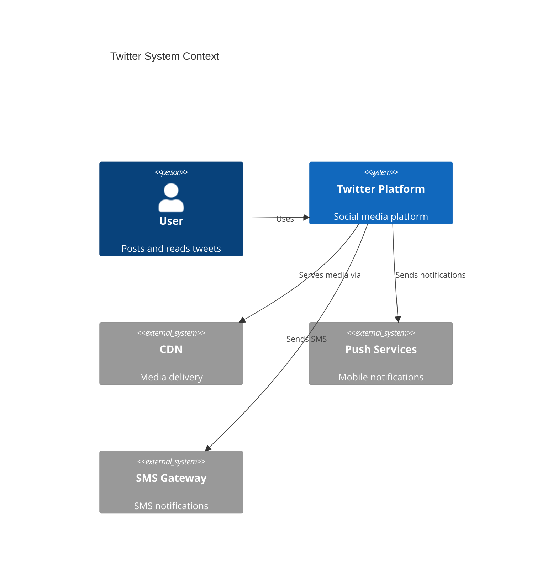
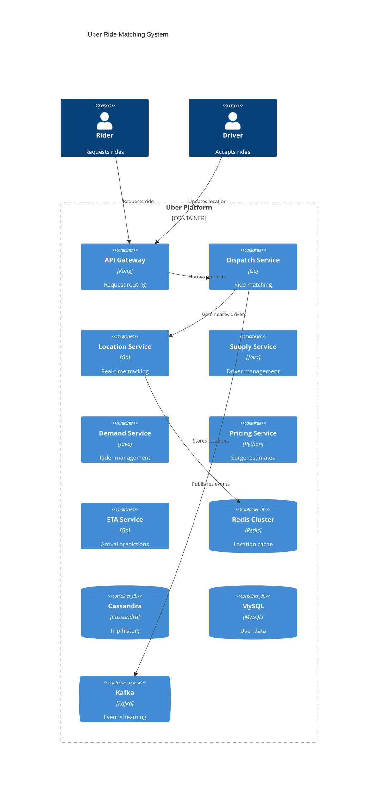
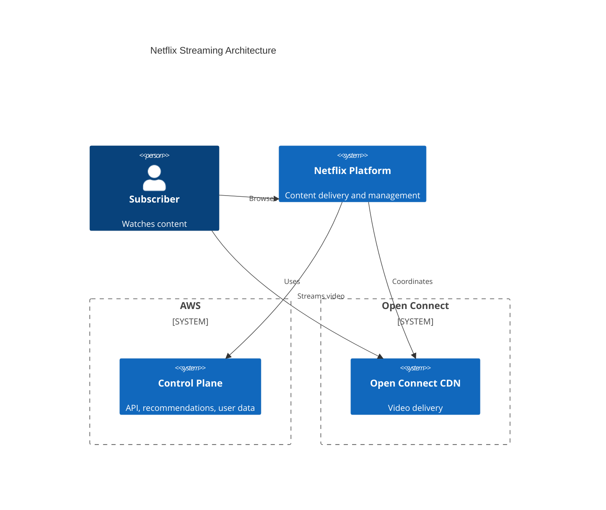

# System Design Examples

Real-world architecture case studies from Twitter, Uber, and Netflix.

## Twitter: Social Feed System

### Requirements

**Functional:**
- Post tweets (280 chars, media)
- Follow/unfollow users
- View home timeline (tweets from followed users)
- Search tweets
- Notifications

**Non-Functional:**
- 400M+ DAU
- 500K tweets/second (read)
- 5K tweets/second (write)
- Timeline latency < 200ms
- 99.99% availability

### Architecture Overview



### Key Design Decisions

**1. Fan-out on Write vs Read**

| Approach | Pros | Cons |
|----------|------|------|
| Fan-out on Write | Fast reads, pre-computed | Slow writes, storage heavy |
| Fan-out on Read | Fast writes | Slow reads, compute heavy |
| Hybrid | Balanced | Complex |

**Twitter's Choice:** Hybrid approach
- Regular users: Fan-out on write (pre-compute timelines)
- Celebrity users (>1M followers): Fan-out on read (merge at read time)

**2. Timeline Storage**

```
Timeline Cache (Redis Cluster)
├── user_id:timeline → [tweet_id_1, tweet_id_2, ...]
├── Stores last 800 tweet IDs per user
├── Eviction: LRU
└── Replication: 3 copies across datacenters
```

**3. Tweet Storage**

```
Tweet Store (Manhattan - Twitter's custom KV store)
├── Primary: tweet_id → tweet_data
├── Indexes: user_id → [tweet_ids], hashtag → [tweet_ids]
├── Sharding: by tweet_id
└── Replication: async, eventual consistency
```

### Scaling Patterns

| Challenge | Solution |
|-----------|----------|
| Read heavy (100:1 ratio) | Cache timelines, read replicas |
| Celebrity tweets | Separate fan-out path |
| Media delivery | CDN with edge caching |
| Search | Inverted index (Earlybird) |
| Real-time | Streaming pipeline (Heron) |

### Lessons Learned

1. **Hybrid approaches** often beat pure strategies
2. **Pre-computation** trades storage for latency
3. **Separate hot paths** (celebrities) for special handling
4. **Custom infrastructure** when scale demands it

---

## Uber: Ride Matching System

### Requirements

**Functional:**
- Request rides
- Match riders with nearby drivers
- Real-time location tracking
- ETA calculation
- Payment processing
- Trip history

**Non-Functional:**
- 100M+ active users
- Millions of concurrent trips
- Location updates: every 4 seconds
- Match latency < 5 seconds
- 99.99% availability (critical service)

### Architecture Overview



### Key Design Decisions

**1. Geospatial Indexing**

Problem: Find drivers within X km of rider location

Solution: **Geohashing** + Redis

```
Geohash: Encode lat/long into string
├── Precision 6: ~1.2 km accuracy
├── Nearby search: Query adjacent geohash cells
└── Storage: Redis sorted sets by geohash prefix

Example:
├── Location: (37.7749, -122.4194) → geohash: "9q8yyz"
├── Query: ZRANGEBYLEX drivers "[9q8yy" "[9q8yz"
└── Returns: all drivers in that geohash cell
```

**2. Dispatch Algorithm**

```
1. Rider requests ride at location L
2. Find all drivers within radius R (geohash query)
3. Filter by:
   - Availability status
   - Vehicle type match
   - Driver rating
4. Calculate ETA for top N candidates
5. Offer to lowest ETA driver
6. If declined, offer to next driver
7. Timeout after T seconds, expand radius
```

**3. Location Service**

| Component | Technology | Purpose |
|-----------|------------|---------|
| Ingestion | Kafka | Buffer location updates |
| Storage | Redis Cluster | Hot location data (last 5 min) |
| Archive | Cassandra | Historical trips |
| Index | Custom service | Geospatial queries |

### Scaling Patterns

| Challenge | Solution |
|-----------|----------|
| Millions of location updates/sec | Kafka for ingestion, Redis for storage |
| Geospatial queries | Geohashing with adjacency queries |
| Global deployment | Regional cells, cross-region replication |
| Surge pricing | Real-time demand/supply analysis |
| ETA accuracy | ML models with traffic data |

### Lessons Learned

1. **Geohashing** solves proximity search at scale
2. **Kafka** handles bursty, high-volume event streams
3. **Redis** provides sub-millisecond geospatial queries
4. **Cell-based architecture** enables regional isolation
5. **Eventually consistent** location data is acceptable

---

## Netflix: Video Streaming System

### Requirements

**Functional:**
- Stream video content
- Personalized recommendations
- User profiles and preferences
- Content search
- Download for offline viewing

**Non-Functional:**
- 200M+ subscribers
- 15% of global internet bandwidth
- Streaming start < 3 seconds
- 99.99% availability
- Global reach (190+ countries)

### Architecture Overview



### Key Design Decisions

**1. Open Connect CDN**

Netflix built their own CDN instead of using commercial options:

```
Open Connect Appliances (OCAs)
├── Hardware: Custom servers with high-density storage
├── Placement: ISP datacenters worldwide
├── Capacity: 100+ TB per appliance
├── Content: Pre-positioned based on popularity predictions
└── Routing: Steering service directs clients to optimal OCA
```

**2. Microservices Architecture**

Netflix pioneered microservices at scale:

| Service | Responsibility |
|---------|---------------|
| API Gateway (Zuul) | Request routing, auth |
| User Service | Profiles, preferences |
| Recommendation Engine | Personalization |
| Search Service | Content discovery |
| Playback Service | Stream initialization |
| Content Service | Metadata management |

**3. Resilience Patterns**

| Pattern | Implementation |
|---------|---------------|
| Circuit Breaker | Hystrix |
| Bulkhead | Thread pool isolation |
| Fallback | Cached recommendations |
| Chaos Engineering | Chaos Monkey, Simian Army |

**4. Video Encoding Pipeline**

```
Source Content
    ↓
Encoding Service
├── Multiple resolutions (240p to 4K)
├── Multiple codecs (H.264, VP9, AV1)
├── Multiple bitrates (235 kbps to 16 Mbps)
└── ~1200 files per title

    ↓
Quality Analysis
├── VMAF scoring
├── Per-scene optimization
└── Encoding ladder selection

    ↓
Distribution
├── Package into chunks (4-6 seconds)
├── Encrypt with DRM
└── Deploy to Open Connect
```

### Scaling Patterns

| Challenge | Solution |
|-----------|----------|
| Global scale | Open Connect CDN in 1000+ locations |
| Peak traffic | Pre-position content, predictive caching |
| Failures | Chaos engineering, graceful degradation |
| Personalization | Real-time ML inference at edge |
| Video quality | Adaptive bitrate, per-title encoding |

### Lessons Learned

1. **Build your own CDN** when scale justifies it
2. **Microservices** enable independent scaling and deployment
3. **Chaos engineering** improves resilience through failure injection
4. **Edge computing** for latency-sensitive personalization
5. **Encode once, stream everywhere** with adaptive bitrate

---

## Comparison Summary

| Aspect | Twitter | Uber | Netflix |
|--------|---------|------|---------|
| Primary Challenge | Read-heavy social graph | Real-time location | Bandwidth-heavy delivery |
| Key Pattern | Fan-out + caching | Geohashing | Custom CDN |
| Database | Custom KV store | Cassandra + Redis | Cassandra + EVCache |
| Messaging | Custom streaming | Kafka | Kafka |
| Scaling | Timeline pre-computation | Cell-based architecture | Edge presence |
| Consistency | Eventual | Eventual | Eventual |

## Design Pattern Themes

### 1. Caching Everywhere

All three systems use aggressive caching:
- Twitter: Timeline cache (Redis)
- Uber: Location cache (Redis)
- Netflix: Video cache (Open Connect), metadata cache (EVCache)

### 2. Event-Driven Architecture

Asynchronous processing for scale:
- Twitter: Heron for stream processing
- Uber: Kafka for event streaming
- Netflix: Kafka for data pipeline

### 3. Custom Infrastructure

At extreme scale, build custom solutions:
- Twitter: Manhattan (KV store), Heron (streaming)
- Uber: Custom dispatch, Schemaless (storage)
- Netflix: Open Connect (CDN), custom encoding

### 4. Graceful Degradation

Partial functionality over total failure:
- Twitter: Show cached timeline if fresh one unavailable
- Uber: Expand search radius if no drivers nearby
- Netflix: Lower video quality before failing stream

## References

- [Twitter Architecture](https://blog.twitter.com/engineering)
- [Uber Engineering Blog](https://eng.uber.com/)
- [Netflix Tech Blog](https://netflixtechblog.com/)
- [ByteByteGo Case Studies](https://bytebytego.com/guides/real-world-case-studies/)
- [System Design Primer](https://github.com/donnemartin/system-design-primer)
