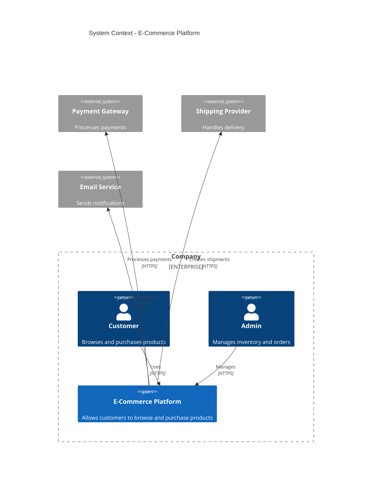
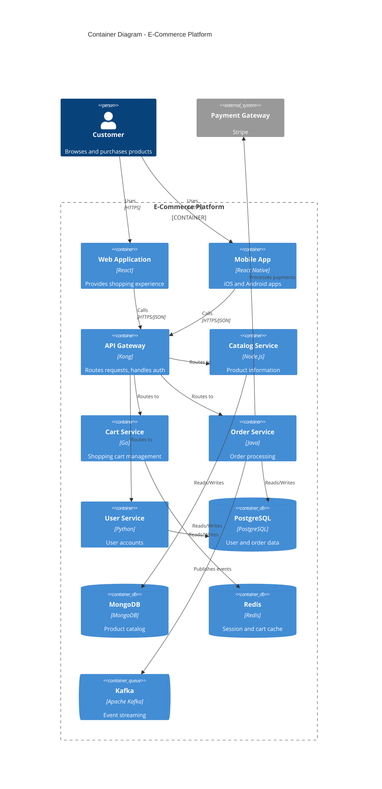
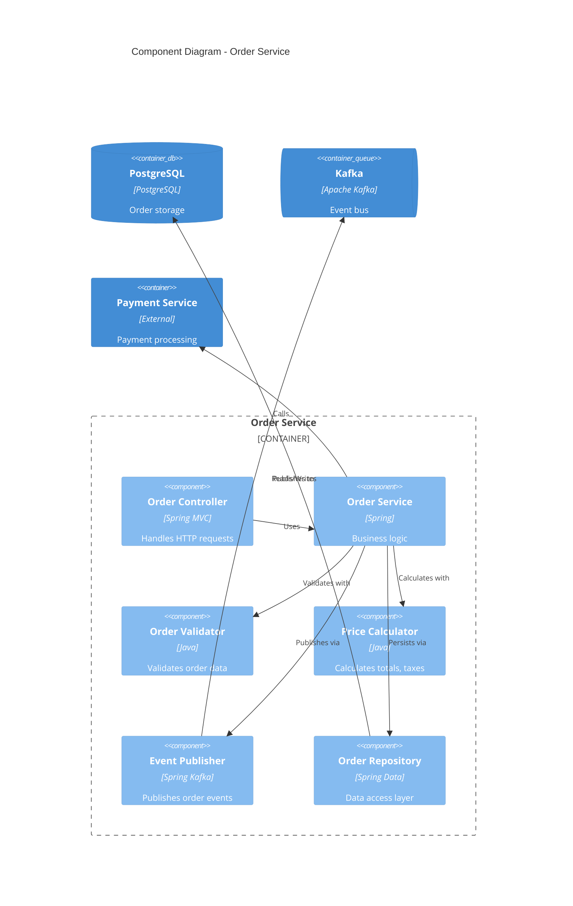
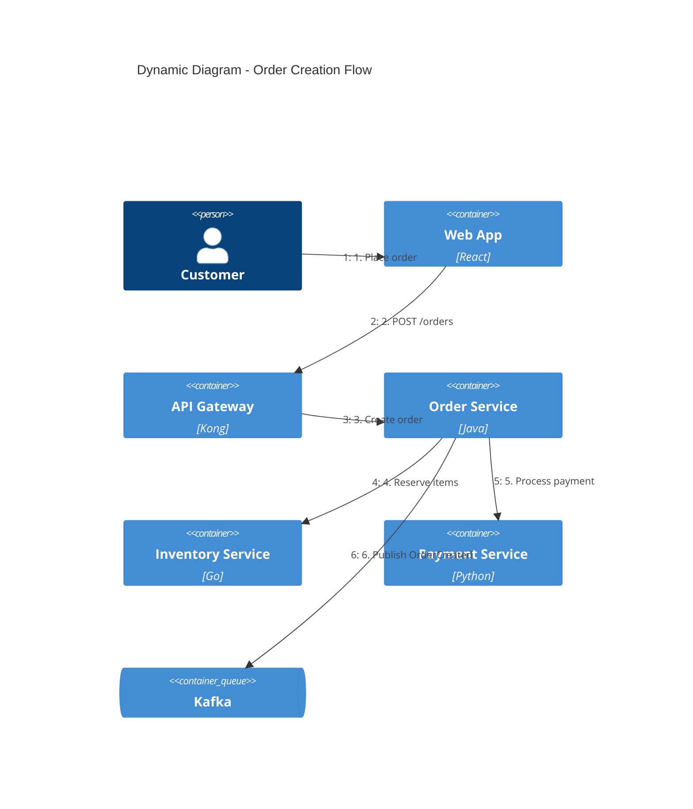
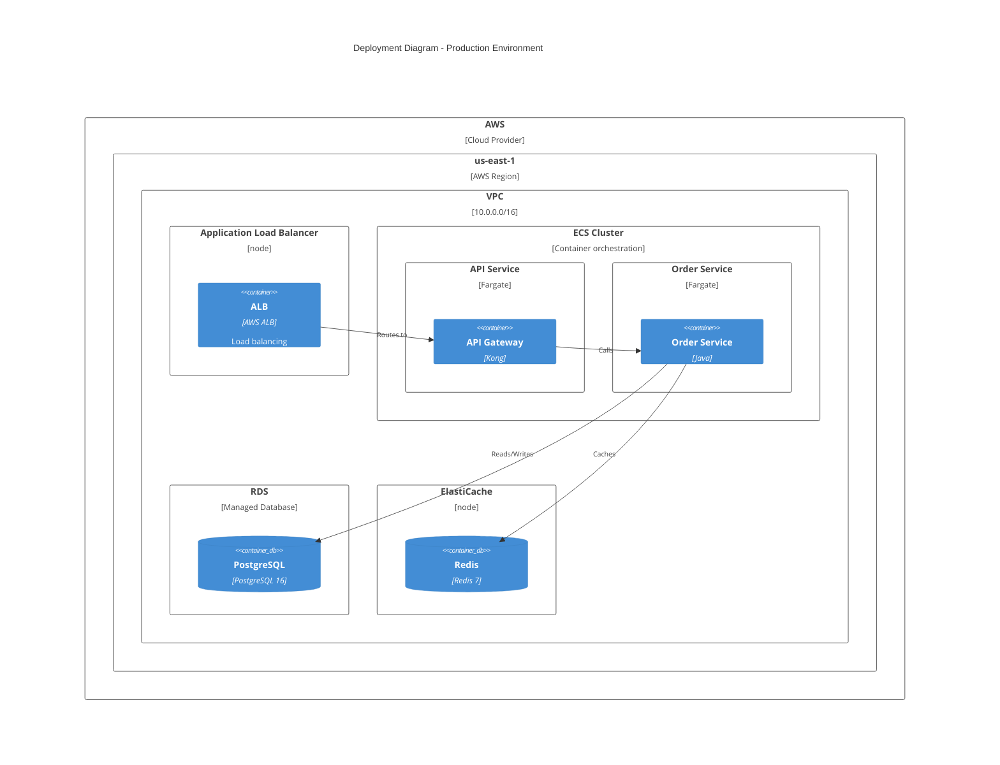
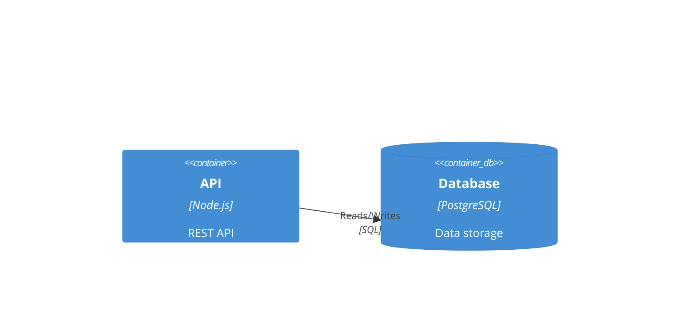
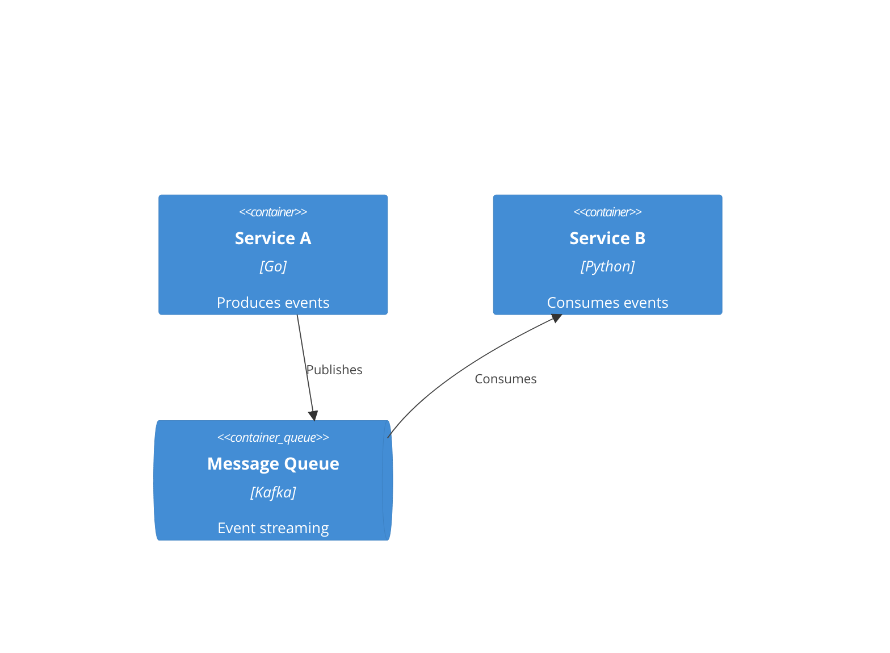
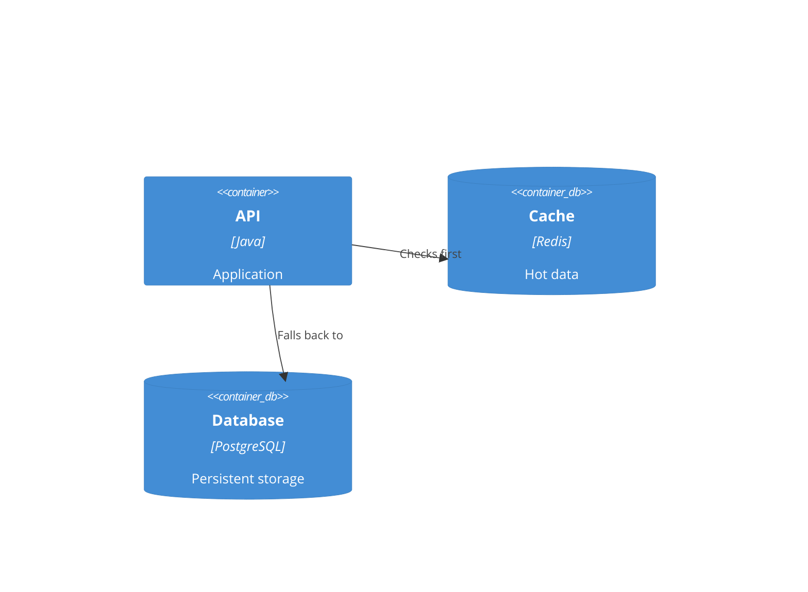

# System Design Templates

ADR templates, C4 diagrams in Mermaid, and design document structures.

## Architecture Decision Records (ADR)

### MADR Template (Recommended)

```markdown
# ADR-NNN: Title

## Status

Proposed | Accepted | Deprecated | Superseded by ADR-XXX

## Context

What is the issue that we're seeing that is motivating this decision or change?

## Decision

What is the change that we're proposing and/or doing?

## Consequences

What becomes easier or more difficult to do because of this change?

### Positive
- ...

### Negative
- ...

### Neutral
- ...
```

### Compact ADR Template

```markdown
# ADR-NNN: Title

**Status:** Accepted
**Date:** YYYY-MM-DD
**Deciders:** [list of people]

## Context
[1-2 sentences describing the problem]

## Decision
We will use [technology/approach] because [primary reason].

## Alternatives Considered
| Option | Pros | Cons |
|--------|------|------|
| Option A | ... | ... |
| Option B | ... | ... |

## Consequences
- [positive consequence]
- [negative consequence requiring mitigation]
```

### Y-Statement Template

For quick decisions:

```markdown
# ADR-NNN: Title

In the context of [situation],
facing [concern],
we decided for [option],
and against [other options],
to achieve [quality attributes],
accepting [tradeoff].
```

### ADR Examples

**ADR-001: Use PostgreSQL for Primary Database**

```markdown
# ADR-001: Use PostgreSQL for Primary Database

**Status:** Accepted
**Date:** 2026-01-15
**Deciders:** Architecture Team

## Context
We need a primary database for our SaaS application. Requirements include:
- ACID transactions for financial data
- JSON support for flexible schemas
- Full-text search capabilities
- Strong ecosystem and tooling

## Decision
We will use PostgreSQL 16 as our primary database.

## Alternatives Considered
| Option | Pros | Cons |
|--------|------|------|
| PostgreSQL | ACID, JSON, extensions, free | Harder to scale writes |
| MySQL | Simple, fast reads | Limited JSON, fewer extensions |
| MongoDB | Flexible schema, scale-out | No joins, eventual consistency |
| CockroachDB | Distributed, SQL | Newer, higher latency |

## Consequences
- Positive: Rich feature set, strong community, proven at scale
- Negative: Manual sharding if we exceed single-node capacity
- Mitigation: Read replicas first, evaluate Citus for sharding later
```

**ADR-002: Adopt Event-Driven Architecture**

```markdown
# ADR-002: Adopt Event-Driven Architecture for Inter-Service Communication

**Status:** Accepted
**Date:** 2026-01-20

## Context
Our monolith is being decomposed into microservices. Services need to communicate
while maintaining loose coupling and enabling async workflows.

## Decision
We will use Apache Kafka for event-driven communication between services.

Events will follow the CloudEvents specification:
- Event type: `com.company.service.entity.action`
- Event schema: Avro with schema registry

## Alternatives Considered
| Option | Pros | Cons |
|--------|------|------|
| Kafka | Durable, ordered, replay | Operational complexity |
| RabbitMQ | Simple, flexible routing | No replay, less durable |
| AWS SQS | Managed, serverless | No ordering guarantees |
| gRPC | Low latency, typed | Synchronous coupling |

## Consequences
- Positive: Loose coupling, event replay, audit trail
- Negative: Eventual consistency, debugging complexity
- Mitigation: Correlation IDs, distributed tracing, idempotent consumers
```

---

## C4 Diagrams in Mermaid

### Level 1: System Context



### Level 2: Container Diagram



### Level 3: Component Diagram



### Dynamic Diagram



### Deployment Diagram



---

## Design Document Templates

### Full Design Document

```markdown
# Design Document: [Feature/System Name]

**Author:** [Name]
**Reviewers:** [Names]
**Status:** Draft | In Review | Approved
**Last Updated:** YYYY-MM-DD

---

## 1. Overview

### 1.1 Summary
[2-3 sentences describing what this design covers]

### 1.2 Goals
- [Goal 1]
- [Goal 2]

### 1.3 Non-Goals
- [Explicitly out of scope item 1]
- [Explicitly out of scope item 2]

### 1.4 Success Metrics
| Metric | Target | Measurement |
|--------|--------|-------------|
| [Metric 1] | [Target] | [How to measure] |

---

## 2. Requirements

### 2.1 Functional Requirements

| ID | Requirement | Priority |
|----|-------------|----------|
| FR-1 | [Requirement] | Must |
| FR-2 | [Requirement] | Should |

### 2.2 Non-Functional Requirements

| Attribute | Requirement | Rationale |
|-----------|-------------|-----------|
| Scalability | [Target] | [Why] |
| Availability | [Target] | [Why] |
| Latency | [Target] | [Why] |

### 2.3 Constraints
- [Technical constraint]
- [Business constraint]
- [Resource constraint]

---

## 3. High-Level Design

### 3.1 System Context
[C4 Context diagram]

### 3.2 Container Architecture
[C4 Container diagram]

### 3.3 Key Components
| Component | Responsibility | Technology |
|-----------|---------------|------------|
| [Component] | [What it does] | [Tech stack] |

---

## 4. Detailed Design

### 4.1 Component: [Name]

#### Responsibilities
- [Responsibility 1]
- [Responsibility 2]

#### Interface
\`\`\`typescript
interface [ComponentName] {
  method(param: Type): ReturnType;
}
\`\`\`

#### Behavior
[Sequence diagram or description]

### 4.2 Data Model

#### Entities
[ER diagram or schema]

#### Schema
\`\`\`sql
CREATE TABLE [table_name] (
  id UUID PRIMARY KEY,
  ...
);
\`\`\`

### 4.3 API Design

#### Endpoints
| Method | Path | Description |
|--------|------|-------------|
| POST | /api/v1/[resource] | Create [resource] |
| GET | /api/v1/[resource]/{id} | Get [resource] |

#### Request/Response
\`\`\`json
// POST /api/v1/[resource]
{
  "field": "value"
}

// Response
{
  "id": "uuid",
  "field": "value"
}
\`\`\`

---

## 5. Scalability & Reliability

### 5.1 Scaling Strategy
- Horizontal: [Which components, how]
- Vertical: [Limits, when to switch]

### 5.2 Failure Handling
| Failure Mode | Detection | Response | Recovery |
|--------------|-----------|----------|----------|
| [Failure] | [How detected] | [Immediate action] | [Long-term fix] |

### 5.3 Data Backup & Recovery
- Backup frequency: [Schedule]
- Retention: [Duration]
- RTO: [Target]
- RPO: [Target]

---

## 6. Security

### 6.1 Authentication
[Method and implementation]

### 6.2 Authorization
[Model and implementation]

### 6.3 Data Protection
- At rest: [Encryption method]
- In transit: [TLS version]

### 6.4 Threat Model
| Threat | Likelihood | Impact | Mitigation |
|--------|------------|--------|------------|
| [Threat] | High/Med/Low | High/Med/Low | [Mitigation] |

---

## 7. Trade-offs & Alternatives

### 7.1 Considered Alternatives

#### Option A: [Name]
- Pros: [Benefits]
- Cons: [Drawbacks]
- Why rejected: [Reason]

#### Option B: [Name]
- Pros: [Benefits]
- Cons: [Drawbacks]
- Why chosen: [Reason]

### 7.2 Known Trade-offs
| Decision | Trade-off | Rationale |
|----------|-----------|-----------|
| [Decision] | [What we give up] | [Why acceptable] |

---

## 8. Implementation Plan

### 8.1 Phases
| Phase | Scope | Dependencies |
|-------|-------|--------------|
| 1 | [Core functionality] | None |
| 2 | [Extended features] | Phase 1 |

### 8.2 Milestones
| Milestone | Definition of Done |
|-----------|-------------------|
| M1 | [Criteria] |
| M2 | [Criteria] |

---

## 9. Open Questions

| Question | Owner | Due Date | Resolution |
|----------|-------|----------|------------|
| [Question] | [Name] | [Date] | [Pending/Resolved: answer] |

---

## 10. References

- [Link to related design]
- [Link to external resource]
```

### Lightweight Design Template

For smaller features or technical spikes:

```markdown
# Design: [Feature Name]

**Date:** YYYY-MM-DD | **Author:** [Name] | **Status:** Draft

## Problem
[What problem are we solving?]

## Proposed Solution
[How will we solve it?]

## Design

### Architecture
[Diagram or description]

### Data Model
[Schema changes]

### API Changes
[New/modified endpoints]

## Alternatives Considered
1. [Alternative 1]: Rejected because [reason]
2. [Alternative 2]: Rejected because [reason]

## Risks & Mitigations
| Risk | Mitigation |
|------|------------|
| [Risk] | [Mitigation] |

## Open Questions
- [ ] [Question 1]
- [ ] [Question 2]
```

---

## Diagram Cheat Sheet

### Mermaid C4 Syntax

```
# Elements
Person(alias, "Label", "Description")
System(alias, "Label", "Description")
System_Ext(alias, "Label", "Description")
Container(alias, "Label", "Technology", "Description")
ContainerDb(alias, "Label", "Technology", "Description")
ContainerQueue(alias, "Label", "Technology", "Description")
Component(alias, "Label", "Technology", "Description")

# Boundaries
Enterprise_Boundary(alias, "Label") { }
System_Boundary(alias, "Label") { }
Container_Boundary(alias, "Label") { }
Deployment_Node(alias, "Label", "Description") { }

# Relationships
Rel(from, to, "Label")
Rel(from, to, "Label", "Technology")
BiRel(from, to, "Label")
```

### Common Patterns

**API + Database:**


**Microservices with Message Queue:**


**Cache Layer:**


## References

- [ADR GitHub](https://adr.github.io/) - ADR templates and tooling
- [MADR Template](https://adr.github.io/madr/) - Markdown ADR format
- [Mermaid C4 Docs](https://mermaid.js.org/syntax/c4.html) - C4 diagram syntax
- [C4 Model](https://c4model.com/) - Official C4 documentation
- [Structurizr](https://structurizr.com/) - C4 diagrams as code
