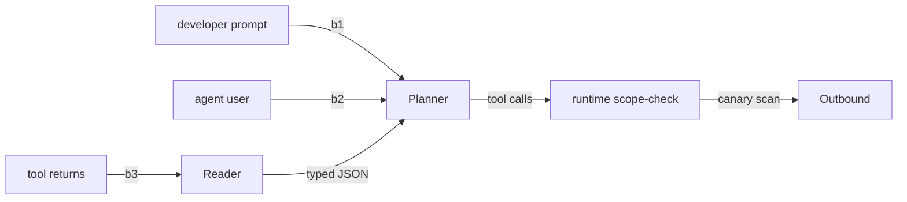

<!--
purpose: Markdown skeleton for the operator-authored trust-boundary diagram + sources/taint table.
consumes: agent architecture sketch + tool registry
produces: human-reviewable boundaries section, copy-paste targets for defense-spec.json
depends-on: content/04-procedure.xml step 2; templates/defense-spec.schema.json
token-budget-impact: not loaded by agent; reference doc for human reviewer only
-->
# Trust boundaries — {agent_name}

## Diagram

## Boundary table

| id | label | channel | trust level |
|----|-------|---------|-------------|
| b1 | developer instructions | system | trusted |
| b2 | agent user | user | partially_trusted |
| b3 | tool-returned content | tool | untrusted |

## Untrusted sources

| source | trust_level | max_size_kb | content_type |
|--------|-------------|-------------|--------------|
| {source_name} | untrusted | {N} | {mime} |

## Taint rules

| source_pattern | wrap_with | max_quote_chars |
|----------------|-----------|-----------------|
| {regex} | `<untrusted-content source="...">{body}</untrusted-content>` | 16000 |

## Tool scope allow-lists

| tool | allowed_paths | allowed_hosts |
|------|---------------|---------------|
| {tool_name} | [...] | [...] |

## Canary

- token_format: `CANARY-{uuid}`
- outbound_check: `abort_on_match`

## Eval set

- path: `evals/ipi/`
- min_categories: 10
- min_cases: 20
