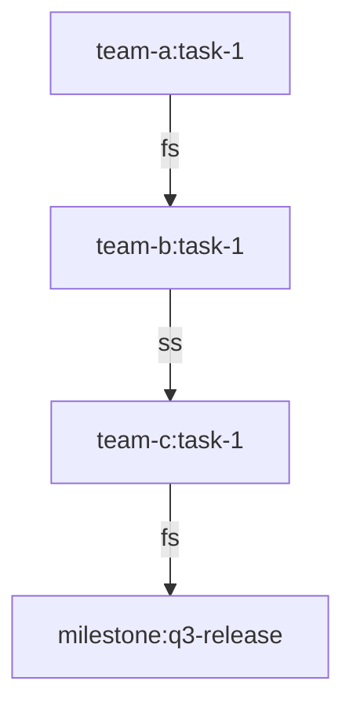

# Dependency Graph Reasoning

## Summary

**One-sentence:** Maintains a typed cross-team dependency graph + queries so 'what is at risk if X slips by 1 week' is deterministic, not tribal.

**One-paragraph:** Maintains a typed cross-team dependency graph + queries so 'what is at risk if X slips by 1 week' is deterministic, not tribal. The methodology is anchored to a single named consumer (a PM, EM, portfolio owner, or downstream agent) and a fixed-shape artefact that downstream review can sign off without re-deriving reasoning. Inputs are explicit, evidence is anchored, and the artefact carries `version`, `owner`, and `last_reviewed` so it remains a living operating tool rather than folklore. Outputs that fail the contract are rejected at validation time, not at executive review.

**Ефективно для:** Програмному PM — детермінована відповідь на 'що блокується, якщо команда B зриває контракт API на тиждень'.

## Applies If (ALL must hold)

- Program involves >= 3 contributing teams with cross-functional milestones.
- Slips and blockers happen often enough that informal tracking fails (>=1 surprise blocker per month).
- A single program PM (or pair) is accountable for cross-team coordination.
- Source-of-truth trackers (Jira, Linear, GitHub Projects) exist per team.

## Skip If (ANY kills it)

- Single-team project — sprint planning suffices.
- Teams explicitly run async / no-dependencies — graph would be sparse and noisy.
- Org has a dedicated PMO tool maintaining a portfolio graph — extend it, do not fork.

## Prerequisites

| Input artifact | Format | Source |
|---|---|---|
| Team + lead roster | Markdown/YAML | delivery-org roster |
| Per-team tracker export | JSON/CSV | Jira / Linear / GitHub Projects |
| Cross-team milestone list | Markdown/JSON | program plan |
| Graph-storage choice | config | team-agreed (Mermaid+Markdown OR DOT+Graphviz OR JSON) |

## Assumes Loaded

<!-- canonical: meta.json -> assumes_loaded (spec §3.2) -->

| Methodology | Why |
|-------------|-----|
| `geek/pm/project-manager/cross-role-handoff-protocol` | Defines the edge types this graph stores. |
| `geek/pm/program-dependency-aging-chart-recipe` | Sibling recipe — aging chart consumes the same graph. |

## Content (load on demand)

| File | Depth | What's inside | Est. tokens |
|------|-------|---------------|-------------|
| `content/01-core-rules.xml` | essential | Testable rules every application enforces | ~1000 |
| `content/02-output-contract.xml` | essential | JSON Schema + valid/invalid examples + self-check | ~800 |
| `content/03-failure-modes.xml` | essential | Antipatterns with symptom / root-cause / fix | ~900 |
| `content/06-decision-tree.xml` | essential | Root question → branches → conclusions (rule refs) | ~400 |

## Task Routing

| Sub-task | Model | Rationale |
|----------|-------|-----------|
| `extract-dependencies-from-trackers` | sonnet | Per-team ticket parsing; bounded judgment. |
| `compute-blocked-by` | haiku | Pure graph traversal. |
| `at-risk-if-slip-analysis` | opus | Multi-edge what-if scenario reasoning. |

## Templates

| File | Purpose |
|------|---------|
| `templates/skeleton.mmd` | Mermaid skeleton for the program graph with team-prefixed node naming and typed edges. |
| `templates/header.yaml` | Frontmatter contract: owner, version, last_reviewed for the produced artefact. |

Files the packer does not ship standalone have their bodies inlined under `## Template Contents` at the end of this file - read them there, do not fetch the path.

## Scripts

| File | Purpose | When to call |
|------|---------|--------------|
| `scripts/validate-dependency-graph-reasoning.py` | Validate produced artefact against the JSON Schema in `02-output-contract.xml`. | Pre-merge and on every artefact refresh. |

## Related

<!-- canonical: meta.json -> related, wikilink bullets only (spec §3.2) -->

- [[program-dependency-aging-chart-recipe]]
- [[cross-role-handoff-protocol]]
- [[okr-cascade-team-to-company]]

## Decision tree

The mandatory decision tree at `content/06-decision-tree.xml` Decides whether to build the graph (>=3 teams + recurring blockers + chosen storage) or skip it (overhead exceeds value). Run before the first graph file is committed.

## Template Contents

Bodies of the templates above that the packer does not ship as standalone files, inlined here so they are deliverable.

### `templates/skeleton.mmd`



### `templates/header.yaml`

```yaml
version: 0.1.0           # bump on every refresh; semver
owner: <role>:<person>   # named person, never a team
last_reviewed: YYYY-MM-DD
evidence_root: <link>    # URL or file path that anchors body claims
```
