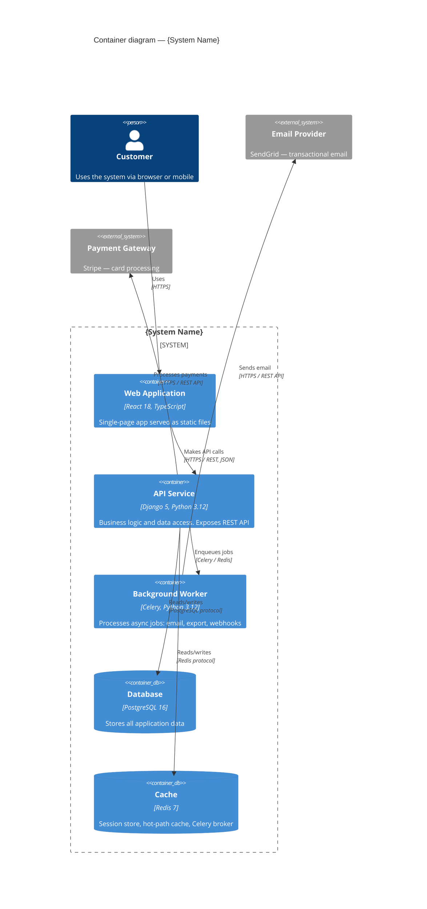

# C4 Container Diagram — {System Name}

Rendered natively in GitHub and GitLab. Requires Mermaid 10.3+.

## Notes

- Replace `{System Name}` with the actual system name.
- Each `Container()` shows: alias, name, technology, description.
- Each `Rel()` shows: from, to, label, protocol.
- Mermaid C4 does not support Deployment diagrams — use Structurizr DSL or PlantUML for those.
- For Level 3 (Component) diagrams use `C4Component` with `Component()` and `ComponentDb()` elements.
