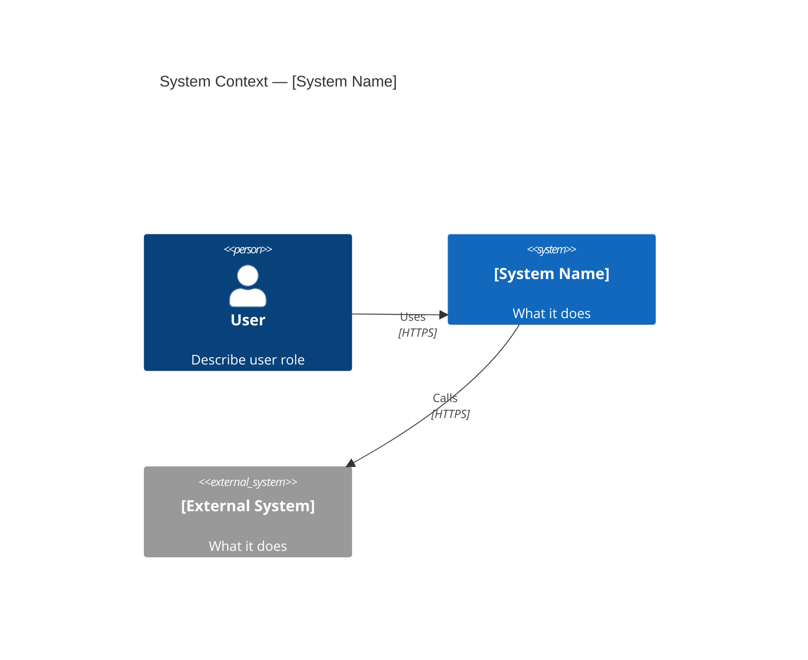
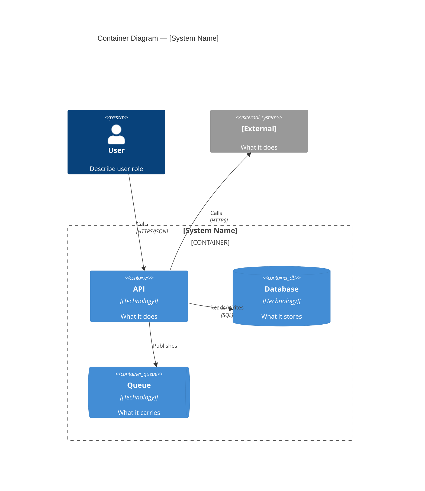
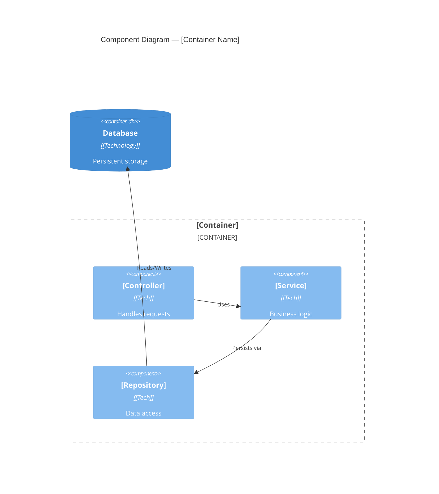
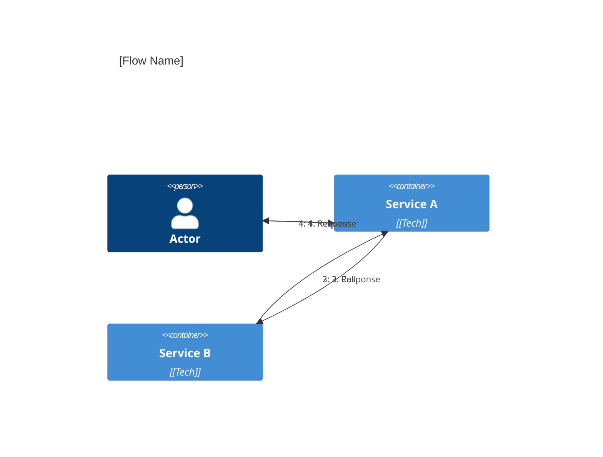

# C4 Diagrams in Mermaid — Skeleton Templates

## Level 1: System Context

```mermaid
C4Context
    title System Context — [System Name]
    Person(user, "User", "Describe user role")
    System(sys, "[System Name]", "What it does")
    System_Ext(ext1, "[External System]", "What it does")
    Rel(user, sys, "Uses", "HTTPS")
    Rel(sys, ext1, "Calls", "HTTPS")
```

## Level 2: Container

```mermaid
C4Container
    title Container Diagram — [System Name]
    Person(user, "User", "Describe user role")
    Container_Boundary(sys, "[System Name]") {
        Container(api, "API", "[Technology]", "What it does")
        ContainerDb(db, "Database", "[Technology]", "What it stores")
        ContainerQueue(mq, "Queue", "[Technology]", "What it carries")
    }
    System_Ext(ext, "[External]", "What it does")
    Rel(user, api, "Calls", "HTTPS/JSON")
    Rel(api, db, "Reads/Writes", "SQL")
    Rel(api, mq, "Publishes")
    Rel(api, ext, "Calls", "HTTPS")
```

## Level 3: Component

```mermaid
C4Component
    title Component Diagram — [Container Name]
    Container_Boundary(c, "[Container]") {
        Component(ctrl, "[Controller]", "[Tech]", "Handles requests")
        Component(svc, "[Service]", "[Tech]", "Business logic")
        Component(repo, "[Repository]", "[Tech]", "Data access")
    }
    ContainerDb(db, "Database", "[Technology]", "Persistent storage")
    Rel(ctrl, svc, "Uses")
    Rel(svc, repo, "Persists via")
    Rel(repo, db, "Reads/Writes")
```

## Dynamic Diagram

```mermaid
C4Dynamic
    title [Flow Name]
    Person(actor, "Actor")
    Container(svc1, "Service A", "[Tech]")
    Container(svc2, "Service B", "[Tech]")
    Rel(actor, svc1, "1. Request")
    Rel(svc1, svc2, "2. Call")
    Rel(svc2, svc1, "3. Response")
    Rel(svc1, actor, "4. Response")
```
